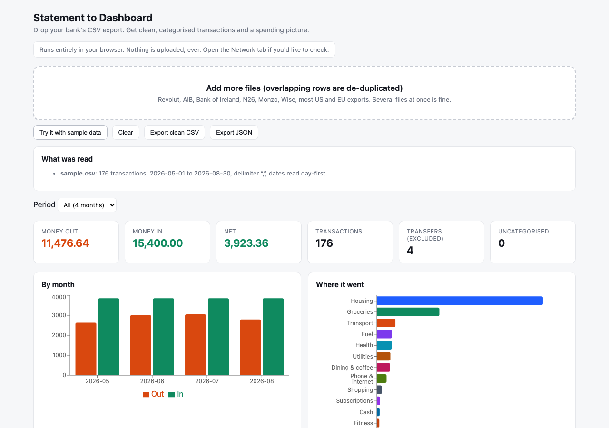

# Statement to Dashboard

[](https://github.com/harshalsahetiya94-oss/statement-to-dashboard/actions/workflows/ci-and-pages.yml)

**Live: https://harshalsahetiya94-oss.github.io/statement-to-dashboard/** (try it with the sample data, or drop your own file; nothing is uploaded)

Drop your bank's CSV export. Get clean, categorised transactions and a spending picture. **Everything runs in your browser; nothing is uploaded.**



## Why

Every bank exports a different CSV. Dates are day-first or month-first, amounts are `1.234,56` or `1,234.56` or `(45.00)` or `45.00 DR`, the merchant is buried in `POS TESCO STORES 4321 12AUG26`, and pending rows sit next to completed ones. Spreadsheets choke on it; budgeting apps want your login. This tool reads the mess on your own machine and hands back a clean table and a dashboard.

It grew out of a personal finance tracker I built in three rounds during 2026: a command-line categoriser, then a statement reader that used a language model, then a phone-side CSV reader inside a household app. This is the reader, rebuilt as a standalone library with absolute dates, multi-file merge and de-duplication, a rules-based categoriser that needs no model, and recurring-payment detection.

## What it does

- **Reads** Revolut, AIB, Bank of Ireland, N26, Monzo, Wise, typical US and German exports, and files with no header row (columns are guessed from the data). Delimiter sniffing, quoted cells, header aliases in English and German.
- **Normalises** dates (day-first vs month-first inferred from the data, with an explicit ambiguity warning), amounts in every notation, currencies, fees (folded into the amount), and merchant names (`POS DUNNES STORES 6781 12AUG26` → `Dunnes Stores`).
- **Holds back** pending rows and **flags** your own money moving (top-ups, transfers to savings) so they never count as spending.
- **Merges** several files and removes rows repeated across overlapping exports, while keeping genuine repeats inside one file (two coffees on one day are real).
- **Categorises** with keyword rules (about 300 built in, Irish, UK, EU, US and Indian merchants). Correct a row, tick *remember*, and the merchant is learned. Your rules stay in your browser's local storage.
- **Shows** money in and out by month, where it went by category, top merchants, and **recurring payments** (same merchant, steady amount, weekly / monthly / yearly rhythm) with the annualised cost and the next expected date.
- **Exports** a clean CSV (`date, merchant, category, direction, amount, currency, transfer, description, source`) or JSON.

## Use it

**In the browser:** open the [hosted app](https://harshalsahetiya94-oss.github.io/statement-to-dashboard/), or run it locally:

```bash
npm install
npm run dev
```

**From the command line:**

```bash
npm run build:lib
node bin/statement-parse.mjs statement.csv another.csv            # summary table
node bin/statement-parse.mjs statement.csv --csv > clean.csv        # clean CSV
node bin/statement-parse.mjs statement.csv --json                   # JSON
node bin/statement-parse.mjs statement.csv --rules my-rules.json    # your own keyword → category rules
node bin/statement-parse.mjs statement.csv --month-first            # when 03/04/2026 means March 4
```

`my-rules.json` is a list like `[{"keyword": "dunnes", "category": "Groceries"}]`.

**As a library** (TypeScript, zero dependencies):

```ts
import { parseStatement, mergeStatements, categoriseAll, monthly, byCategory, recurring, toCleanCsv } from "statement-to-dashboard";

const a = parseStatement(textA, { fileName: "revolut.csv" });
const b = parseStatement(textB, { fileName: "aib.csv" });
const { transactions } = mergeStatements([a, b]);
const txs = categoriseAll(transactions);
console.log(monthly(txs), byCategory(txs), recurring(txs));
console.log(toCleanCsv(txs));
```

## How it decides things

| Question | Rule |
|---|---|
| Which column is the date? | Header aliases first (`Date`, `Posted Transactions Date`, `Completed Date`, `Buchungstag`, …). Without a header, the column where most cells parse as dates. |
| Day-first or month-first? | Count rows where the first number exceeds 12 (must be a day) against rows where the second does. Tie with no evidence: assume day-first and say so. |
| Debit or credit? | Separate debit/credit columns win. A single amount column uses the sign, brackets, `DR`/`CR` markers, or a type column. |
| Is it a transfer? | Description mentions top-up, savings, internal transfer, own account, or a money-movement app; refunds are excluded. |
| Is it recurring? | Three or more spends at one merchant, amounts within 15% of the median, gaps that cluster at 7, 28 to 31, or 365 days. |
| Is it a duplicate? | Same date, direction, amount and merchant appearing in two different files. |

Every one of those is a plain function in `src/lib/` with a test in `tests/` against synthetic statements for nine bank dialects. If your bank's export is not read correctly, add its header row to `tests/fixtures/` and open an issue or a pull request.

## Privacy

The page makes no network requests after it loads. Files are read with the browser's `File.text()` and never leave the tab. Saved rules live in `localStorage` under `std.rules.v1`. There is no analytics, no backend, no account.

## Run the tests

```bash
npm test
```

## Licence

MIT. Built by Harshal Sahetiya.
